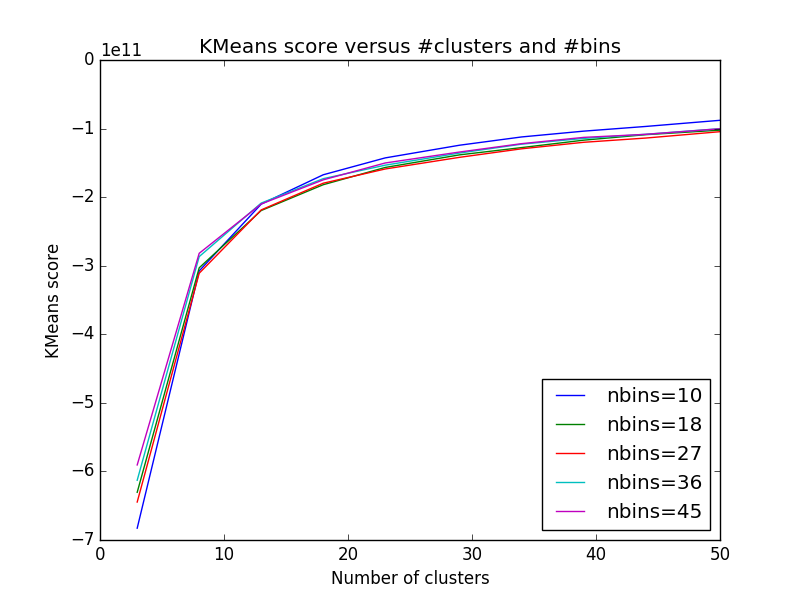

Runs computer vision algorithms on a Street Fighter 4 replay match

#Inspiration
Capcom's analysis of match between Snake Eyez (Zangief) and Fuudo (Fei Long)
[YouTube](http://youtu.be/dlIcud319Yk?t=15m42s)

#Run

I'm currently testing on a match in training stage since the background of
training stage is a lot easier. The match is [Infiltration (Gouken) vs Tokido
(Akuma)] (https://www.youtube.com/watch?v=XuqzhjKHhag).

1. Download [this video](https://www.youtube.com/watch?v=XuqzhjKHhag) as
   `data/my_video.mp4`, with your video downloader of choice
2. Run

<b></b>

    >> # supervised learning with HoG/SVM
    >> python3 train_SVM.py data/my_video.mp4 data/Infiltration_Gouken_vs_Tokido_Gouki.txt
    >> # unsupervised learning with patch-wise KMeans (trained on 3% of patches from 6 handpicked frames)
    >> python3 train_SVM.py data/my_video.mp4 0.03

#Results

## Supervised learning
  
Date: Feb 18 2015

## Unsupervised learning

  
Date: Nov 28 2015

I wanted to apply unsupervised learning to the task since I'm lazy to hand-label frames. One method to do so is to cluster patches in a training set and then during inference, cluster all patches of the video frame by frame.

The question then is - which frames do I include in my training set? To answer this, I described every frame in the video as a histogram of its Hue channel (one of the channels in HSV space) and KMeans-clustered the entire video. For every cluster, I took the frame that was closest to the cluster center (I call such a frame an 'exemplar) and included it in the training set. As a pre-processing step to getting the exemplars, I applied the elbow method to determine the optimal number of clusters in KMeans. This number turns out to be about 10.

 
Date: Nov 27 2015
